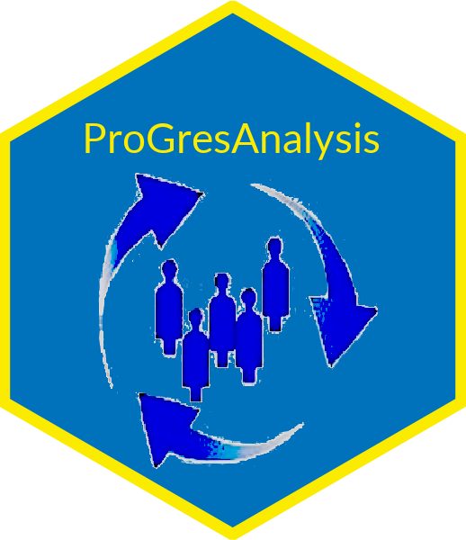

<!-- README.md is generated from README.Rmd. Please edit that file -->

```{r, echo = FALSE}
knitr::opts_chunk$set(
  collapse = TRUE,
  comment = "#>",
  fig.path = "README-"
)
```

# `{proGresAnalysis}`   


An R package for advanced statistical analysis of [Refugee Registration database & assistance tracking](https://www.unhcr.org/registration-guidance/chapter3/registration-tools/)

## Installation and usage

You can install `{proGresAnalysis}` from GitHub with:

```{r gh-installation, eval = FALSE}
# install.packages("devtools")
devtools::install_github("edouard-legoupil/proGres-analysis")

## The package relies on data from public API to generates of the chart

install.packages(idbr)
## We then advise to 
#idbr::idb_api_key('Your API key goes here')

```

Once `{proGresAnalysis}` installed, you can create a new RMD using the custom template.

Using [RStudio](https://www.rstudio.com/):

 * Step 1: Click the "File" menu then "New File" and choose "R Markdown".

 * Step 2: In the "From Template" tab, choose one of the built-in templates.

You will then just need to fill in the [YAML parameters](https://rmarkdown.rstudio.com/lesson-6.html):

 * `ridl`: "tto-extraction-02-2022"
 * `dir`:
 * `country`: "Trinidad and Tobago"


## Output

The package is designed to work on a standard query in the registration database that aggregates key variables at household levels. Many reports are already produced from proGres but they mostly look at univariate analysis, i.e each variable within the dataset is displayed one by one. This package is an attempt to explore various dimensions interact between each others. 

The package include a function to retrieve that data and another one to tidy the results. The main output  is an Exploratory Data Analysis Report generated as a powerpoint and ready for [Joint Data Interpretation](https://www.youtube.com/watch?v=0jE-Y7g88K4&feature=youtu.be&t=2305)  


## Feedback

Users are welcome to flag bugs, suggest improvements and/or submit feature request [here](https://github.com/edouard-legoupil/proGres-analysis/issues/new)


